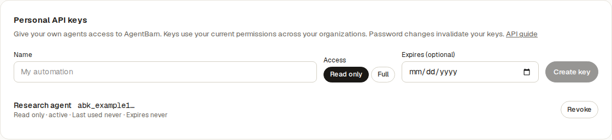

# Personal API keys — PR evidence

The API transcript below came from the FastAPI test client against a fresh PostgreSQL 18 Testcontainers database upgraded through Alembic to `e4b9d72c160a`. The command was `api/.venv/bin/python -m pytest -s -q api/tests/integration/test_api_key_evidence_temp.py`; that temporary evidence script was removed after capture. The User and Organization were test fixtures, and the issued secret was redacted. The calls exercised real route, authentication, service, repository, and migration behavior. Redis enqueue warned because no worker was configured; the outbox transaction completed and the test passed.

```text
POST /api/v1/auth/me/api-keys (session; read-only)
HTTP 201  mode=READ_ONLY  token=abk_[REDACTED]
GET /api/v1/auth/context (API key)
HTTP 200  credential_class=API_KEY  access_mode=READ_ONLY  organizations=1
GET /api/v1/organizations/{organization_id} (API key)
HTTP 200
POST /api/v1/auth/me/api-keys (read-only API key)
HTTP 403  detail=This API key is read-only
DELETE /api/v1/auth/me/api-keys/{key_id} (session)
HTTP 204
GET /api/v1/auth/context (revoked API key)
HTTP 401
GET /api/v1/discovery (public)
HTTP 200  operations=210
```

The Account screenshot was captured from Chromium running the Playwright `creates, reveals once, and revokes a key` flow, after the one-time secret was dismissed. Its API responses are fixture data; the screenshot contains no live key or personal data.



Browser scenarios at the Account page:

| Scenario | Observed result |
| --- | --- |
| New key and revoke | Key appears after creation, complete secret disappears after Done, revocation changes its status. |
| Empty and loading | Loading message appears while the list request is pending; empty message appears when it returns no keys. |
| Request error | A failed list offers Retry; a successful retry restores the empty state. |
| Permission error | HTTP 403 shows a specific permission message. |
| Adjacent account content | The existing Change password section remains visible. |

The Account tests use mocked API responses to isolate browser behavior. The API transcript and integration tests cover the real backend boundary. Live staging and production were not exercised.
